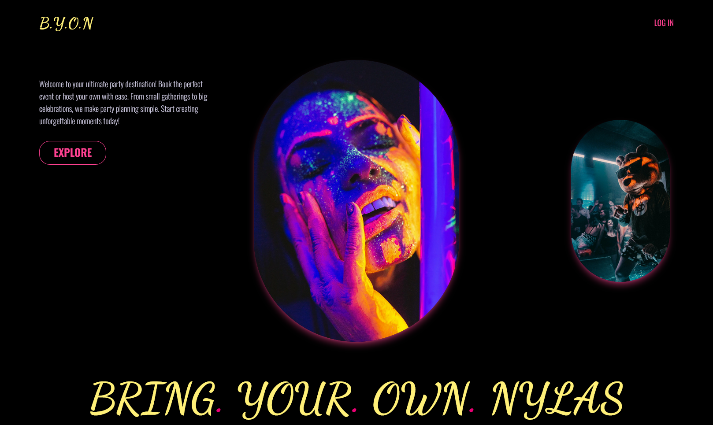

# B.Y.O.N (Bring Your Own Nylas)

**B.Y.O.N** is a full-stack party booking website where users can discover and book passes for parties or events in their city. Users can also host their own parties, making them available for others to book. The platform provides hosts with tools to manage guest lists and communicate with guests via email. [Live](https://byon.vercel.app/)

## 🔋 Tech Stack

- **Framework**: Next.js 14
- **Styling**: Tailwind CSS
- **Database**: Supabase
- **Email API**: Nylas API

## ⚡ Features

1. **Authentication**

   - Users authenticate through Nylas hosted authentication using their Gmail ID.
   - A unique user profile is created in Supabase, and sessions are maintained with JWT tokens stored in cookies.

2. **Homepage**

   - The landing page (`/`) introduces BYON with a login button.
   - Only the homepage is accessible without authentication.

3. **Protected Routes**

   - All routes except the homepage are protected.
   - Unauthorized access redirects users to the login page (`/login`).

4. **Event Listings**

   - **Events Page (`/events`)**: Displays events currently taking place in major cities like Delhi NCR, Mumbai, and Bengaluru. Users can filter events by city.
   - **Event Details Page (`/events/[eventId]`)**: Provides detailed information about the selected event, including booking options.

5. **Booking Events**

   - Users can book a pass for events directly from the event details page.
   - Upon booking, a confirmation email is sent to the user via Nylas Email API, and the booking is stored in Supabase.
   - Booked events are listed on the Activity page (`/account/activity`).

6. **User Account**

   - **Profile Page (`/account`)**: Displays and allows updating user profile information. First-time logins require users to complete their profile.
   - **Activity Page (`/account/activity`)**: Shows a list of upcoming and past events booked by the user.
   - **Host a Party Page (`/account/host`)**: Provides information about hosting events and allows users to create new events.
   - **Manage Events Page (`/account/manage`)**: Lists all active and expired events hosted by the user, with options to edit event details and manage the guest list.

7. **Event Management**

   - **Create Event Page (`/new-event`)**: Hosts can create new events by filling out a form. Events are immediately available for booking upon creation.
   - **Edit Event Page (`/account/manage/[eventId]`)**: Hosts can update event details, which are reflected across the site.
   - **Manage Guest List Page (`/account/manage/guestlist/[eventId]`)**: Allows hosts to manage their guest list, check-in attendees, and send emails.

8. **Email Communication**

   - **Direct Email**: Hosts can email individual attendees directly from the guest list.
   - **Bulk Email**: Hosts can send or schedule bulk emails to all attendees.
   - **Scheduled Emails**: Hosts can view and cancel scheduled emails using the Nylas Email API.

9. **Sign Out**
   - Users can sign out, which deletes the session from cookies and redirects them to the homepage.

## 🚀 API and Endpoints

- Authentication handled via Nylas API.
- Bookings, user profiles, events, and scheduled emails stored and managed in Supabase.

## License

This project is licensed under the MIT License.
